layout: true
class: inverse

<style type="text/css">
.remark-inline-code{color: #7f9f7f;}
.quote{ color: #dca3a3 }
</style>

---

```{r setup, include=FALSE, cache=F}
knitr::opts_chunk$set(echo = TRUE, message = FALSE, collapse = TRUE, warning = FALSE, fig.align = 'center', fig.height = 4, dpi = 300, cache = TRUE)
# knitr::opts_knit$set(root.dir = normalizePath(".."))
pacman::p_load(tidyverse, fontawesome)
options(dplyr.print_min = 5, dplyr.print_max = 5)
```

## What does an epidemiologist do?

--

Tough question!
- Depends on the situation
- Here we will talk briefly about the (low-level) data analytical needs of a *__field__* epidemiologist

--

Data analytics central to outbreak detection and response
- Public health response to outbreak begins with descriptive epidemiology - describing the disease in terms of:
  - __Person__ (WHO) - age, sex, and any other relevant risk factors
  - __Place__ (WHERE) - maps
  - __Time__ (WHEN) - epidemic curve

---
class: middle center

# Diphtheria
# Bangladesh 
# Nov 2017 - Ongoing
    
---

## Context

- Inter-communal violence in Rakhine state, Myanmar, in August 2017

--

- Influx of > 650,000 new refugees into Bangladesh

--

- High risk of epidemic-prone diseases:

--
    - Very poor living conditions
    
        - Cramped, spontaneous settlements
        - High levels of faecally-contaminated drinking water (>80%)  
--
  
    - Chronically underserved population
--
        - Poor access to health services
            - Low vaccination coverage
            - Emergency services, e.g. EmOC
        - Chronic and acute malnutrition

---

## Context

.pull-left[
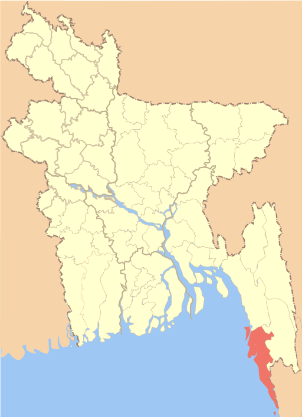
]
.pull-right[
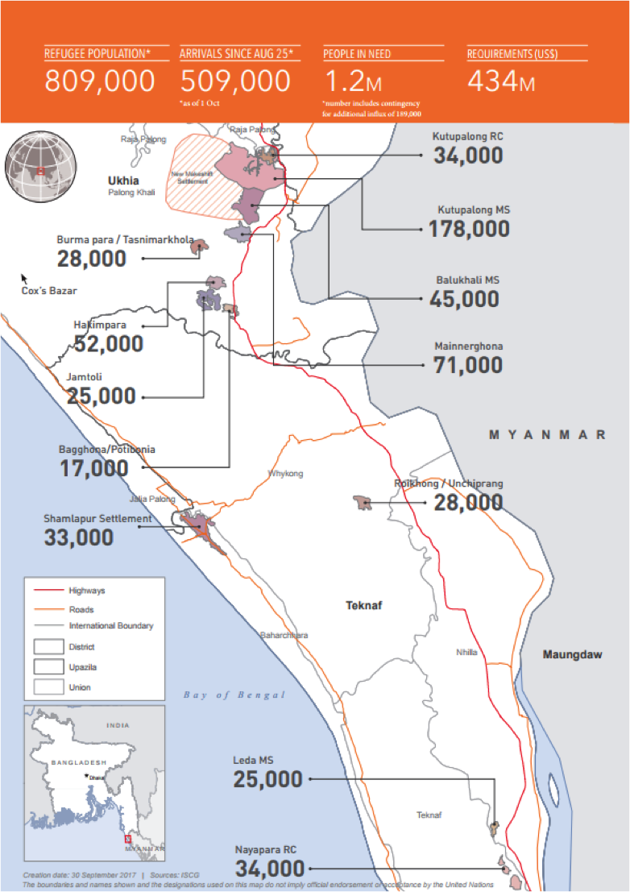
]

---

## Context

.pull-left[
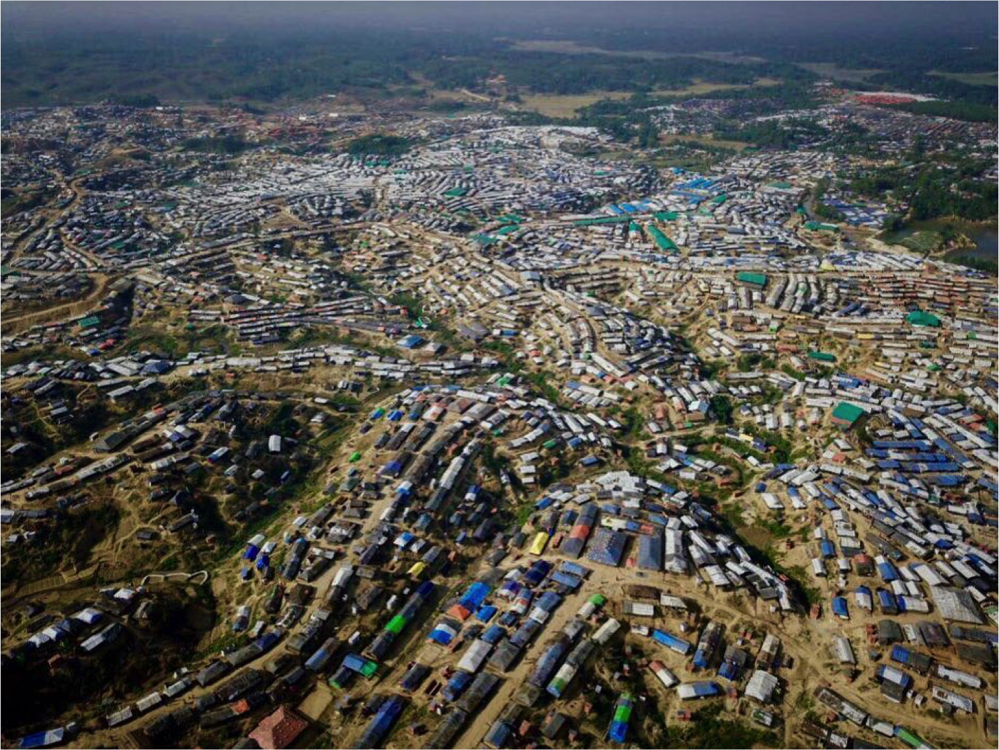
]
.pull-right[
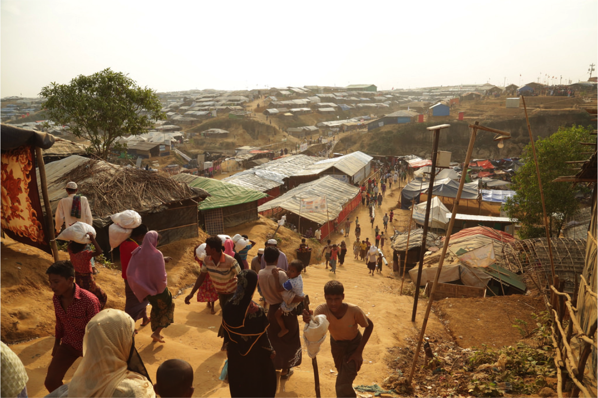
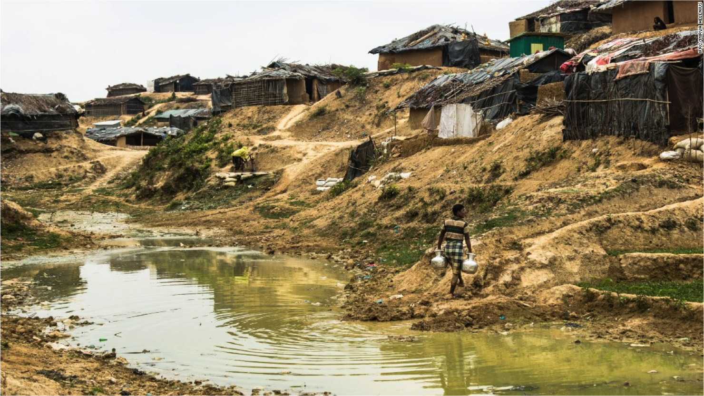
]

---

## Diphtheria outbreak
--

- Bacterial infection
- Person-to-person spread by coughing or sneezing
- Disease caused by release of bacterial toxin 
- Can lead to difficulty breathing, heart failure, paralysis, and even death
--

- Rare outbreaks (recently several within short timeframe)

  - Yemen
  - Indonesia
  - Venezuela

--

- Immediate response activities:

--
    - Establish contact tracing 
--
    - Vaccination campaign
--
    - Forecasting requirements
      - Staffing & bed capacity
      - Chemoprophylaxis & DAT
--
    - Generate automated report using linelist data

---

## Data management

- Information flow: 

--
    - Paper forms filled at HF
--
    - Collected daily by epidemiologists and entered into Excel `r emo::ji("loudly crying face")` 
--
    - Nightly reporting to centralised email
--
    - Processed in `R`

---

## Automated data analysis

.pull-left[
`R` & `RMarkdown` for rapid generation of descriptive epi bulletins
]
.pull-right[
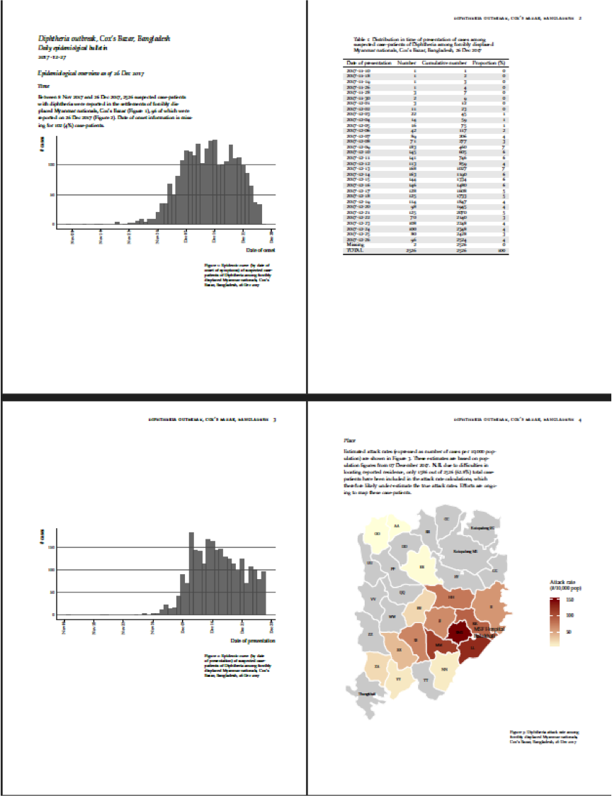
]

???
Epi bulletins are key deliverable but one which typically consumes a lot of time each day

---

## Data management issues:

--
- Delays (poor internet, heavy file) 
--

- Incomplete data (staff capacity overwhelmed, difficulty updating records) 
--

- Management of Excel workbooks 
  - Multiple Tx facilities 
  - Multiple formats 

---
 
## Forecasting for operational needs purposes

.pull-left[
- Bed capacity (engagement with GOARN partners and EMTs)

- Diphtheria Antitoxin (limited global supply)

- Antibiotics (treatment + contact tracing)
]

--

.pull-right[
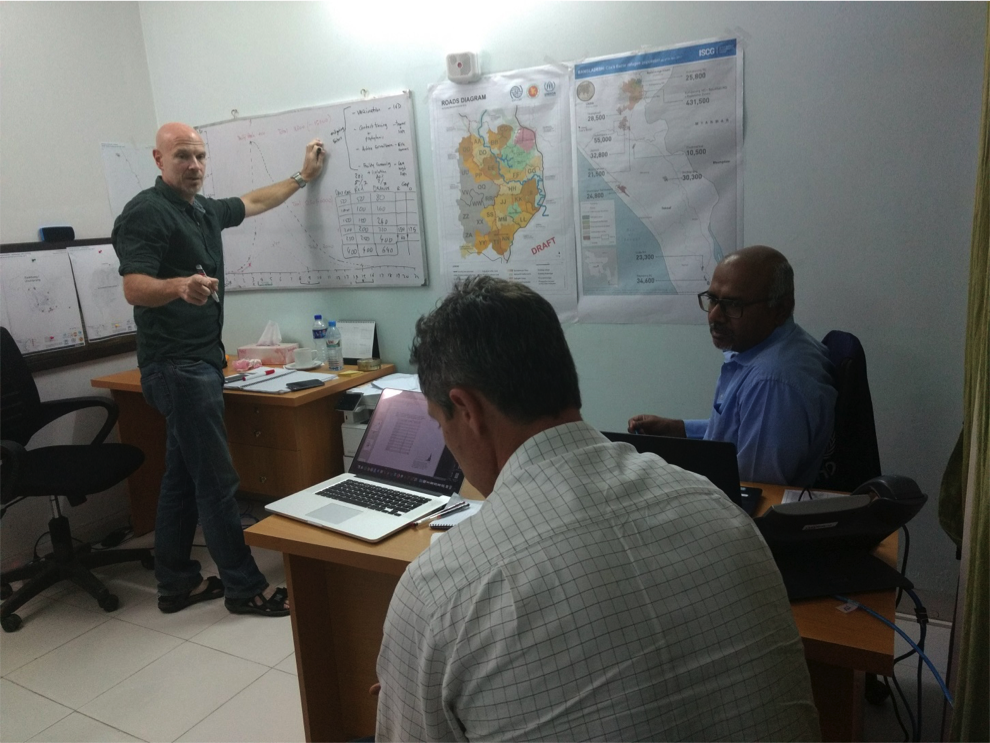
]

---
 
## Forecasting for operational needs purposes

.center[
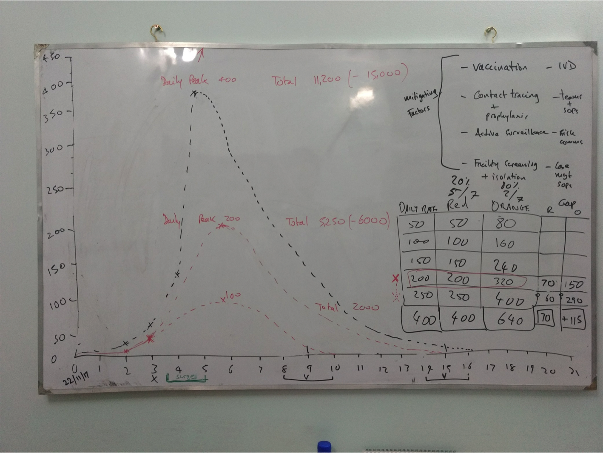
]

--

Clearly, this was a messy, "DIY" fix that needed a more robust system

???
Shows field reality in absence of off-the-shelf tools

---

# EWARS-in-a-box

--

- WHO-led project

--
- System for:
    - __`Early warning`__
        - Weekly aggregated reporting from __HFs__
        - e.g. automated analysis of data revealed outbreak of Hep E
--
    - __`Alert management`__
        - Triggering & investigating alerts
        - Verification & risk assessment
        - Rapid response teams
--
    - __`Outbreak response`__
        - Linelisting of cases during active outbreaks
--
    - Automated analysis and reporting
--
- Managed by administrators at various levels in the country

--

N.B. Apart from alerts which can come from community, is largely a health-facility-based system
        

???
- Mobile allows for MGMT of data collection & standardised data flow
- Electronic data capture as close as possible to point of consultation

---

# EWARS-in-a-box

.center[
.pull-left[
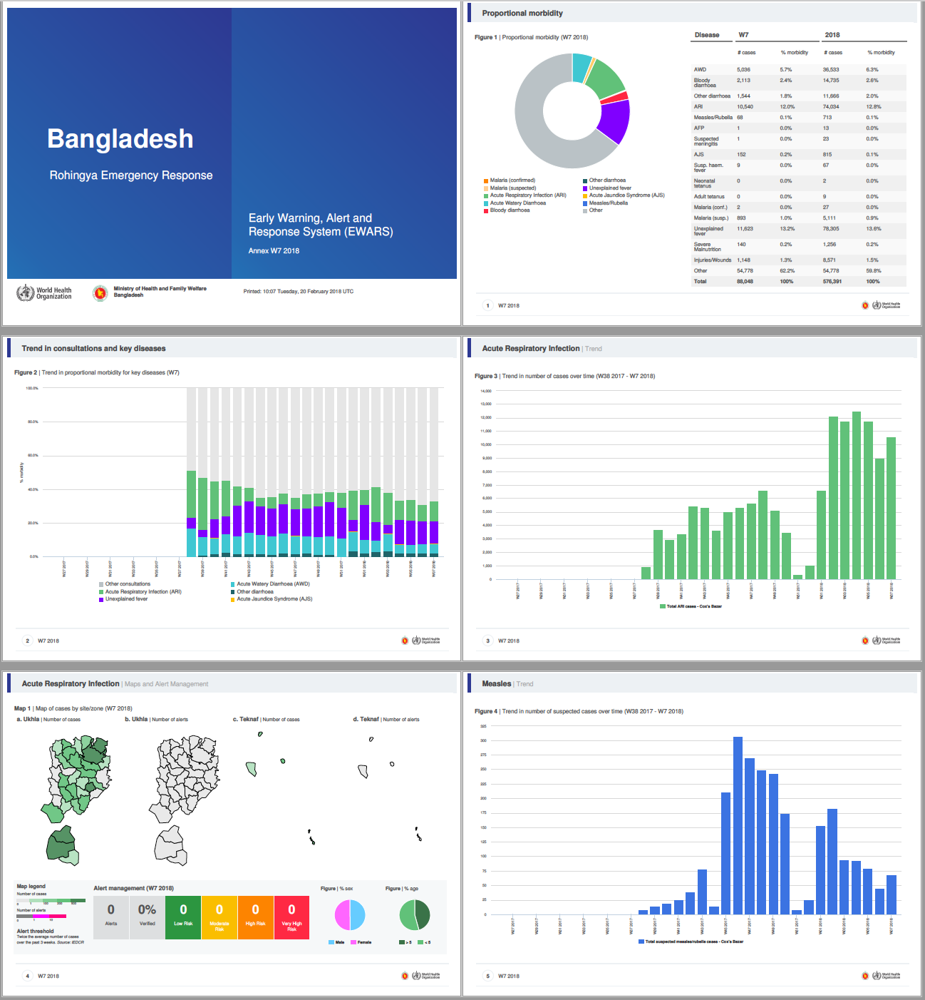
.caption[
EWARS report
]
]
.pull-right[
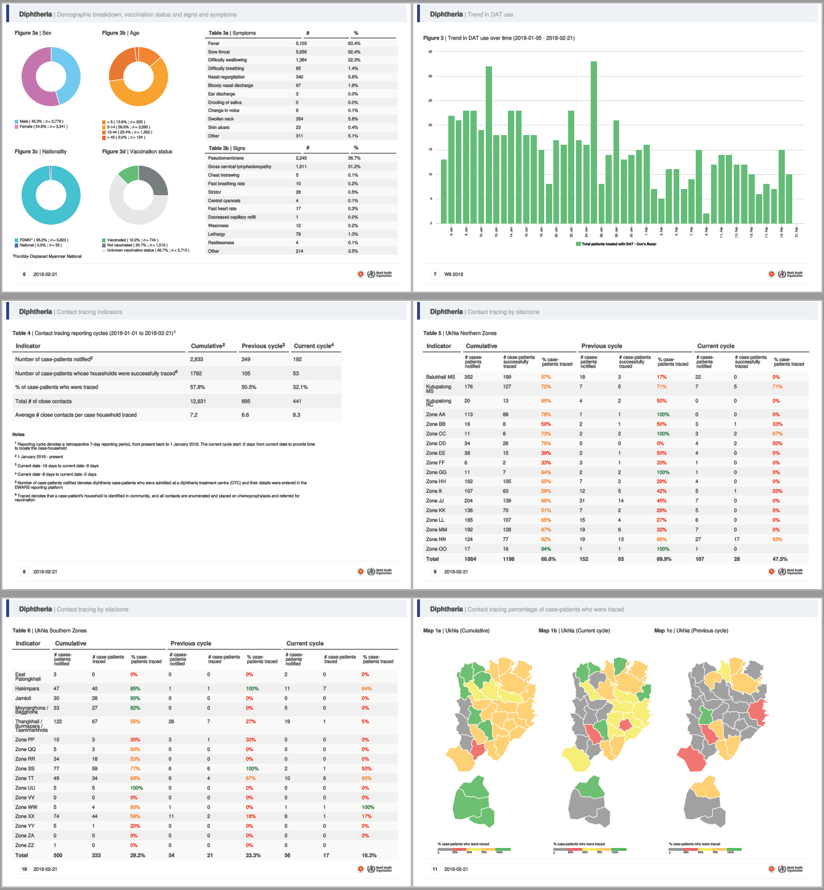
.caption[
Diphtheria report
]
]
]

---
class: middle center

# Ebola Virus Disease
# Democratic Republic of Congo 
# Aug 2018 - Ongoing
    
---

## Context

- Infectious viral disease thought to live in animal resevoir (bats), with occasional spill-over events to humans

- Spread person-to-person through contact with bodily fluid (including sweat) - close contacts

- Has typically high case fatality ratio (CFR), often accompanied by bleeding

--

### Ongoing outbreak

- 680 cases

--

- \>400 deaths (~60% CFR)

--

- Active war zone
  - highly insecure
  - highly inaccessible population

---
class: center middle

<blockquote class="twitter-tweet" data-lang="en"><p lang="en" dir="ltr">This is what our <a href="https://twitter.com/WHO?ref_src=twsrc%5Etfw">@WHO</a> colleagues face every day in their efforts to protect people from <a href="https://twitter.com/hashtag/Ebola?src=hash&amp;ref_src=twsrc%5Etfw">#Ebola</a> in <a href="https://twitter.com/hashtag/DRC?src=hash&amp;ref_src=twsrc%5Etfw">#DRC</a>. I admire their bravery and dedication to keep the world safe, together with our partners from <a href="https://twitter.com/MONUSCO?ref_src=twsrc%5Etfw">@MONUSCO</a>, the UN family and NGOs. <a href="https://twitter.com/hashtag/HealthForAll?src=hash&amp;ref_src=twsrc%5Etfw">#HealthForAll</a> <a href="https://t.co/EBVy67tR6E">pic.twitter.com/EBVy67tR6E</a></p>&mdash; Tedros Adhanom Ghebreyesus (@DrTedros) <a href="https://twitter.com/DrTedros/status/1076031505284190209?ref_src=twsrc%5Etfw">December 21, 2018</a></blockquote>
<script async src="https://platform.twitter.com/widgets.js" charset="utf-8"></script>

---

## Context

.pull-left[

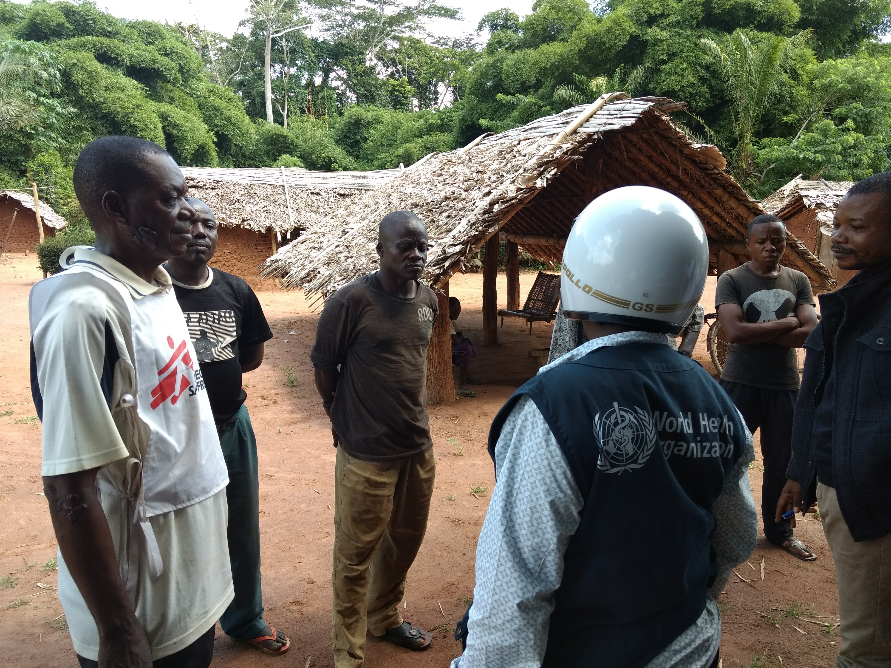
]

--

.pull-right[
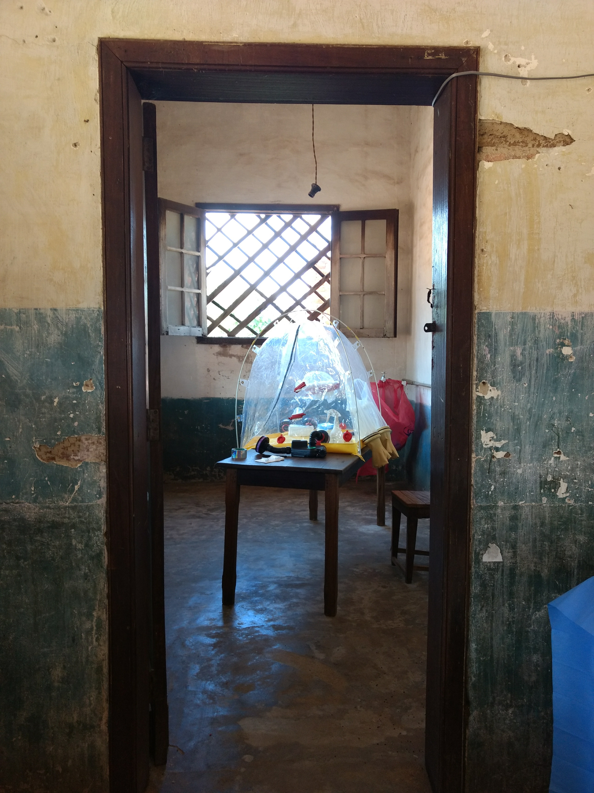
]

---

## Dashboard

<!-- <iframe src="https://rpubs.com/who_emergencies/ebola_drc" width="100%" height="100%" frameBorder="0"></iframe> -->
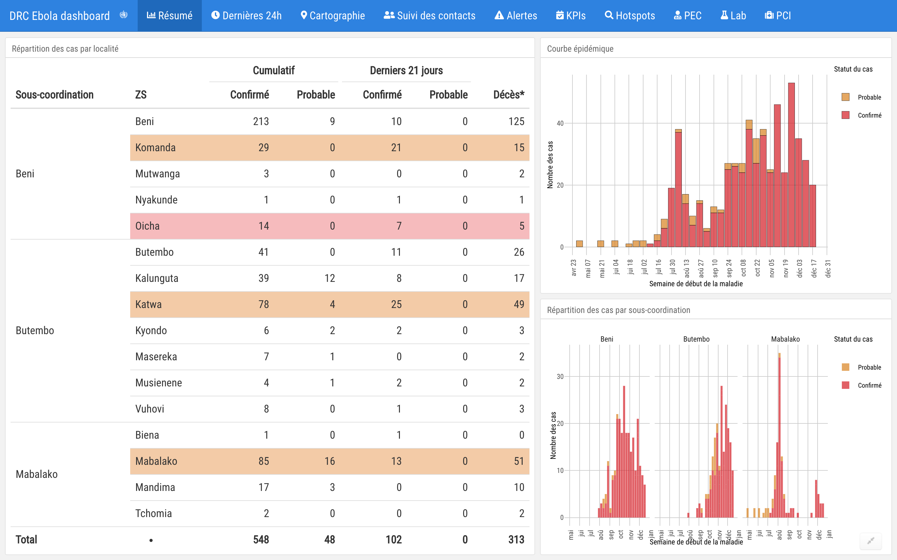

???
focus on the users
- reduce needs of staff to do these analyses
- data for decision-making


---

## Weekly epidemiological 'deep-dive' slide deck

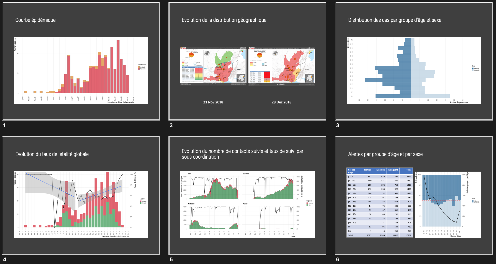

---

## EWARS-in-a-box for alert management

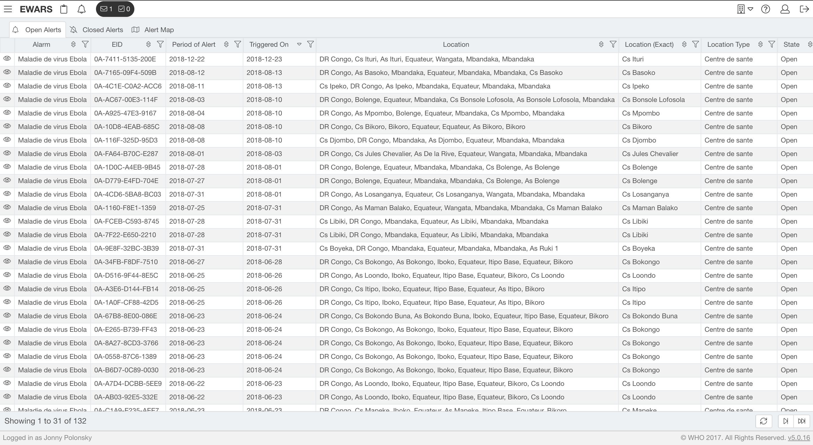

N.B. alerts can come from facility or community
 
---
class: middle centre

# So what about Community-Based Surveillance?

---

- Increasing recognition of the importance of CBS 
--

> "Community-based surveillance - C'est la base. If the foundations of your house are not solid, the rest of your house will not stand!"
>
> &mdash; <cite>Dr. Mike Ryan, WHO Assistant DG for emergencies</cite>

--

- Facility-based surveillance inherently less sensitive to what is happening at community level, as information limited from reaching formal surveillance system by variety of barriers:
  - Geographical
  - Financial
  - Cultural, ...

--

- However, CBS documented very poorly at the moment
    - \# households visited, # alerts detected & verified - all captured on loose scraps of paper, verbal reports, in notebooks of staff passing through
    - Alerts from community can be captured in EWARS tool, but we need something that goes much further...

---

## Closing message

--

- Huge need for a professional tool for this crucial part of the disease surveillance landscape

--

- Currently, there is no robust, agreed-upon and ready-to-use system

--

- This is a gap that _needs_ to be filled 
  - that is where _we_ come in, and the work we are all contributing to at this codeathon has the potential to serve the needs of humanitarian and outbreak-response community and help us use 
  *__`information to save lives`__*

